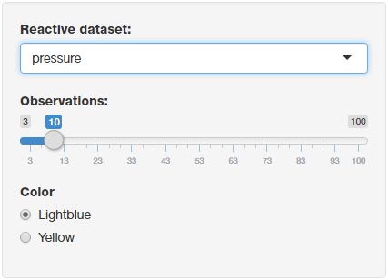

## Introduction

Hi. This web app rendes an histogram chart for 2 different datasets.

--- .class #id 

## Dataset 1: Insect Sprays

This dataset contains data about the quantity of insect sprays.

<div style='text-align: center;'>
    
</div>

--- .class #id 

## Dataset 2: Pressure

This dataset contains data about the pressure.

<div style='text-align: center;'>
    
</div>

--- .class #id 

## Some code

Number of max observations


```r
1000/10
```

```
## [1] 100
```

--- .class #id 

## Thanks!

Thank you for reviewing this!

link to the app:
https://elmesp.shinyapps.io/DataProducts/

--- .class #id
